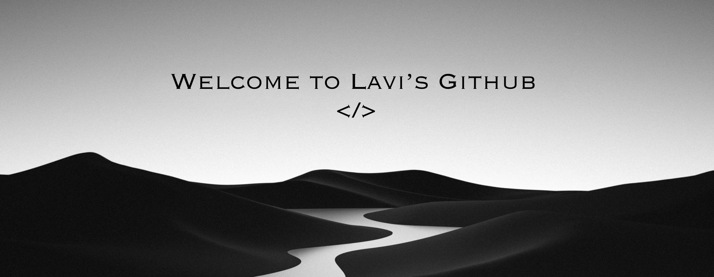

 

<h2 align="center">  <em>Sobre mim </em></h2>

 

  Olá! Meu nome é <em><b>Flávia</b></em> mas sou mais conhecida como <em><b>Lavi</b></em>, sou estudante de Desenvolvimento de Sistemas. 
Gosto de programar, aprender novas linguagens e resolver desafios de código.

Atualmente estou desenvolvendo sites utilizando HTML e CSS, além de criar 
alguns projetos pessoais para praticar minhas habilidades.

 

  
      <em><b> Ex-mentora da  FIRST® LEGO® League Challenge
     
      <em><b> Estudante de Cibersegurança no tempo livre
   
      <em><b> Jogadora de Sudoku e Xadrez  </b></em> 

 
 
<h2 align="center">  <em> Linguagens </em> </h2>

  
  
  
  
  
  
  

 
 

